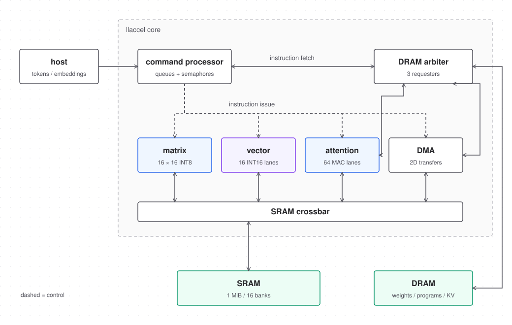
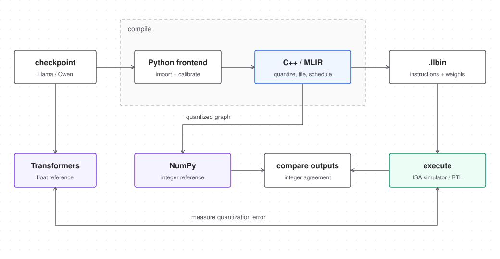

# llaccel

A transformer inference accelerator written in SystemVerilog, with a C++/MLIR
compiler and Python tools for importing and quantizing models.

The project covers the path from a Llama or Qwen checkpoint to instructions that
run on the accelerator. It includes a functional simulator, testbenches and
reference implementations for checking the results.



## How it works

The compiler quantizes the model, fuses operations, splits matrix multiplies into
tiles, assigns SRAM space and schedules instructions across the engines.

The hardware has three compute engines:

- A **16 × 16 INT8 matrix engine** for projections and feed-forward layers.
- A **16-lane vector engine** for RMSNorm, RoPE, SiLU and elementwise operations.
- A **64-lane attention engine** that reads the KV cache from DRAM and processes
  scores in 256-entry tiles.

A DMA engine moves data between DRAM and 1 MiB of banked SRAM. Instruction queues
and semaphores let the engines overlap work. The host handles tokenization,
loads embedding rows and chooses the next token; transformer computations run
on the device.



## Models

The importer supports dense Llama, Qwen2 and Qwen3 models, including grouped-query
attention and Qwen3's Q/K normalization. Model size and context length are limited
by available memory. MoE, multimodal models, dynamic RoPE and active sliding-window
attention are not supported.

See [model support](docs/HF_SUPPORT.md) for supported configurations and import
commands.

## Results

Local Verilator tests pass for all engines and the full system, including
128- and 256-wide attention heads. All 44 compiled Llama/Qwen test runs matched
the integer reference. [Hardware tests](results/verilator-local-2026-09-15/README.md)

Qwen2.5-0.5B and SmolLM2-135M have been run through both the functional simulator
and RTL simulation, with matching results across several prompts, generations up
to 64 tokens and separately initialized context-boundary tests.

A 64-configuration study on the tiny trained model measured **59,531 simulated
cycles per decoded token** at 100-cycle DRAM latency. Increasing the number of
outstanding DMA requests from 16 to 32 gave a **1.58× speedup** in that setup.
[Performance measurements](docs/RESULTS.md)

Calibration changes also reduced the loss in prediction quality from integer
quantization. On a 4,096-token test using short context windows, the perplexity
increase relative to the float model fell from **41.16% to 11.77%** for SmolLM2 and
**76.60% to 17.47%** for Qwen2.5. Lower is better; some accuracy loss remains.
[Quantization experiments](docs/QUANTIZATION_TUNING.md)

The [test reports](results/README.md) include software checks across small
Llama/Qwen configurations and the details behind these measurements.

## Getting started

The commands below build the software simulator on macOS ARM64. You'll need
LLVM/MLIR 23, CMake, Ninja, uv and Python 3.14. See
[toolchain.json](toolchain.json) for the versions used during development and the
[setup notes](docs/REPRODUCIBILITY.md) for more detail.

```sh
uv sync --frozen --extra hf
LLVM_PREFIX="$(brew --prefix llvm)"
cmake -S . -B build/llama-qwen-software -G Ninja \
  -DCMAKE_BUILD_TYPE=Release \
  -DCMAKE_C_COMPILER="$LLVM_PREFIX/bin/clang" \
  -DCMAKE_CXX_COMPILER="$LLVM_PREFIX/bin/clang++" \
  -DLLVM_DIR="$LLVM_PREFIX/lib/cmake/llvm" \
  -DMLIR_DIR="$LLVM_PREFIX/lib/cmake/mlir" \
  -DLLACCEL_RTL=OFF
cmake --build build/llama-qwen-software -j 3
.venv/bin/python3 scripts/regress_dense_hf.py
.venv/bin/python3 scripts/regress_dense_boundary.py
```

The two scripts create small models locally, compile them and check the simulator's
outputs against reference results. They don't download pretrained weights or run
hardware tests. See the [test guide](docs/DENSE_SOFTWARE_REGRESSION.md) for individual
cases and options.

## Hardware tests

With Verilator installed, run the testbenches locally:

```sh
make -C tb all JOBS=3
verilator --lint-only -Wall -f rtl/filelist.f --top-module llaccel_top
```

## Code layout

| Directory | Contents |
| --- | --- |
| `python/llaccel/` | Model import, calibration and reference implementations |
| `compiler/` | MLIR dialect, compiler passes and command-line tools |
| `runtime/` | Host code and simulator backends |
| `rtl/` and `tb/` | Hardware and testbenches |
| `tests/` and `scripts/` | Tests and experiments |
| `docs/` and `results/` | Design notes and measurements |
| `synth/` | Synthesis and physical implementation scripts |

The [documentation index](docs/README.md) links to the architecture, instruction
set and arithmetic details. See [contributing](CONTRIBUTING.md) for development
notes and diagram editing.

## License

[MIT](LICENSE). Model weights, datasets and dependencies have their own licenses.
