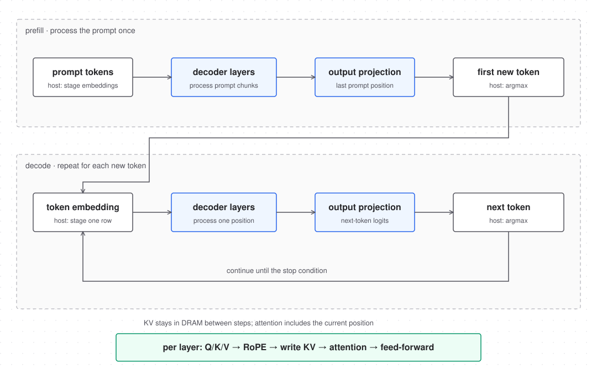
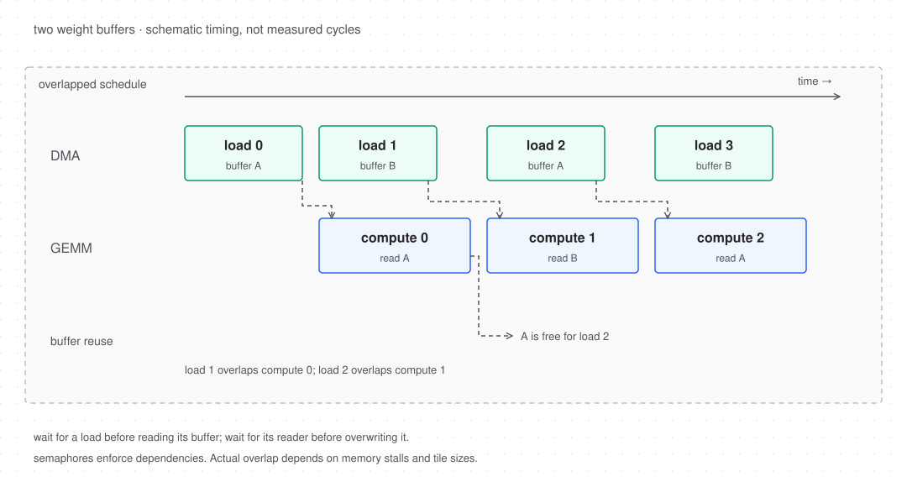

# llaccel microarchitecture

Single clock, asynchronous active-low reset. All parameters live in
`rtl/llaccel_pkg.sv` and mirror `include/llaccel/isa.h`.

| parameter | default | meaning |
|---|---|---|
| `SRAM_BYTES` | 1 MiB | on-chip scratchpad (persistent KV is in DRAM) |
| `NBANKS` | 16 | banks, each 16 B wide; line = 256 B; `bank = addr[7:4]` |
| `GEMM_TN / GEMM_TK` | 16 / 16 | MAC array 16 (n) × 16 (k) INT8 |
| `GEMM_TM` | 16 | max rows per GEMM instruction (accumulator rows) |
| `VEC_LANES` | 16 | i16 lanes |
| `ATTN_LANES` | 64 | i8 MACs; D ∈ {16,32,64,128,256}  |
| `ATTN_TMAX` | 4096 | maximum keys per query; fixed 256-entry score tile |
| `NSEM` | 32 | semaphores |
| `QDEPTH` | 8 | per-engine instruction queue depth |
| `DRAM_BEAT` | 64 B | DRAM data beat |
| `EPILOGUE_FUSION` | 0 (v1) / 1 (v2) | GEMM epilogue RESADD/SILU/MUL datapath present |
| `NUM_PERF` | 27 | performance counters (64-bit) |

## Token generation

Prefill processes the prompt in chunks and fills each layer's KV cache. The last
prompt position produces the first new token. Decode then processes one token at
a time, reusing the cached keys and values. Each layer writes the current K/V
before attention, so attention includes the current position.



## Overlapping loads and compute

With two weight buffers, the scheduler can load the next weight chunk while GEMM
reads the current one. A buffer cannot be overwritten until its previous reader
finishes. Semaphores enforce these dependencies.



The timeline illustrates dependencies, not measured cycle counts. It omits
requantization metadata loads, other engines and memory contention.

## Module hierarchy

```
llaccel_top            (SRAM banks + core; used by Verilator)
 ├─ sram_bank ×16      (behavioral 1-port RAM, 16 B wide, byte enables)
 └─ llaccel_core       (synthesized boundary; SRAM as ports)
     ├─ cmd_proc       fetch (DRAM) → decode → issue; semaphores; HALT/done
     ├─ dma_engine     2-D DRAM↔SRAM copy, 64 B beats
     ├─ gemm_engine    W-tile regs (double-buffered) → 16×16 MAC → i32 acc[16][16] → epilogue
     ├─ vec_engine     16-lane i16 ALU, RMSNorm (isqrt+div), RoPE, SiLU LUT, MUL/ADD/QUANT
     ├─ attn_engine    QK dot, fixed-point softmax (exp LUTs + div), PV, KV write
     ├─ sram_xbar      per-bank fixed-priority arbiter, conflict counters
     ├─ dram_arb       round-robin cmd_proc fetch / dma / attn, held-owner selection
     └─ perf_counters
```

## SRAM crossbar contract

Every requester port is a *line request*: `{valid, we, addr[23:0], nbytes ∈ {16,32,64,256}, wdata[2047:0], wstrb}` where `addr` is `nbytes`-aligned for 256, else 16-aligned, and the transfer never crosses a 256-B line. The xbar grants a request in a cycle iff every bank it touches is not taken by a higher-priority port that cycle; a granted read returns data in the next cycle (`rvalid`, `rdata`), a granted write completes that cycle. Ungranted requests must be held. Priority (high→low):

```
gemm_w (256 B rd) > gemm_a (rd) > gemm_wr > attn_rd > attn_wr > vec_rd0 > vec_rd1 > vec_wr > dma_wr > dma_rd
```
GEMM's `sram_stall` counter adds the number of denied GEMM ports in a cycle; vec, attention and DMA each count a cycle once when any of their ports is denied.

## Command processor

* Prefetch FIFO (4 instructions) from DRAM via the shared round-robin `dram_arb`. Fetch validity remains asserted through backpressure, including a previously presented fetch when HALT returns. Completion drains or discards all accepted responses.
* Decode: header → engine id; `wait_sem/wait_val` checked against the semaphore
  file; stall (counter `cp_stall_wait`) until satisfied; stall when the target
  queue is full (`cp_stall_qfull`).
* Semaphore increments come from engine completion pulses (`done_pulse`,
  `done_signal_sem`); increments and CP checks are ordered so a WAIT sees a
  SIGNAL from the previous cycle.
* `HALT`: stop creating new fetches. A fetch already presented under backpressure remains asserted until accepted; its eventual response is discarded. Assert `done` only when all engines and queues are idle/empty, no fetch is held, and every accepted fetch response has returned.
* `start` is issued only between completed launches; it resets PC, semaphores, perf counters, and queues. It is not an abort mechanism for outstanding DRAM traffic.

## Engine skeleton (shared)

```
input  instr_valid, instr (llaccel_instr_t), output instr_ready
output busy, output done_pulse (one cycle when an instruction has fully retired)
sram port(s) per contract, perf increments
```
Each engine pops one instruction, runs it to completion (FSM), pulses `done`,
then pops the next. Retire order == queue order.

## GEMM engine timing

For `nt in N/16`: for `kt in K/16`: load tile (1 cycle, 256 B), then stream `M`
rows (`A[m][kt·16 +: 16]`, 16 B, 1 row/cycle) through the 16×16 multiplier
array and 16 adder trees into `acc[m][0..15]` (i32, 3-stage pipeline).
Then drain `M` rows: per cycle one row of 16 accumulators → requant (16 ×
(i32·i32→i64 >> S) ) → epilogue → write 32 B (i16) or 16 B (i8). Weight tile
registers are double-buffered so the next tile load overlaps the current
stream (the xbar still serializes the 256-B load against A reads, so per-tile
ideal issue cost is `1 + M` cycles, excluding pipeline drain, metadata/epilogue accesses and other stalls). `rq` (8 B/ch) and `bias` are fetched once per `nt`
(128 B and 64 B total, fetched in at most 64-B requests and split into 16-B pieces when needed). MAC-busy cycles are counted (`gemm_mac_cycles`) for
utilization = mac_cycles / total cycles.

## Vector engine timing

16 lanes/cycle; operands read 32 B/cycle each; 3-stage pipeline (read →
multiply → shift/saturate/write). RMSNorm: pass 1 sum-of-squares (K/16 cycles),
then `isqrt` (24-cycle bit-serial) and `udiv` (32-cycle restoring), then pass 2
(K/16 cycles). RoPE: per row per head, reads `x1`,`x2`,`cos`,`sin` 16 lanes at a time
(D/2/16 steps, 4 reads per step). SiLU: LUT is 257 × u16 ROM, two reads per lane per cycle
(combinational table references in RTL; physical ROM or logic mapping is synthesis-dependent).

## Attention engine timing

Per `(m, h)`, Q is read from SRAM and persistent K/V from DRAM. Three passes over K compute the global raw-score maximum, the global exponential sum, and finally each tile's globally normalized probabilities. The third pass also reads V and accumulates output across tiles. The score/probability buffer has 256 entries regardless of context. This preserves integer softmax across tile boundaries, with a cost of three K reads and one V read per query/head. Query heads sharing KV currently reread it independently.

Up to 32 tagged DRAM read pieces can be outstanding. Naturally aligned D=64 rows use one full beat; D=16/32 rows currently overfetch one beat each. Rows crossing a 64-byte beat use D/16 pieces. KV_WRITE reads SRAM source rows and writes byte-strobed DRAM beats. Output rows return to SRAM. Fetch, DMA and attention share a round-robin DRAM arbiter with ordered response-owner tags and selection held under backpressure.

## DMA engine

Descriptor: rows × row_bytes with strides. Issues 64-B DRAM read beats
(16 outstanding by default, 32 in the measured build) and writes 64 B (4 banks) per cycle into SRAM (`dma_wr`);
stores read 64 B from SRAM and issue 64-B DRAM writes with byte strobes.
Completion = last SRAM write done (load) or last DRAM write accepted (store).

## DRAM interface (to the C++ model)

```
req_valid, req_ready, req_we, req_addr[31:0], req_wdata[511:0], req_wstrb[63:0]
rsp_valid, rsp_rdata[511:0]     (read responses, in order, one per cycle max)
```
The model accepts at most one request per cycle when `req_ready` (64 B per accepted beat), with up to 32 outstanding reads by default. Read responses are ordered, at most one per cycle, with no response backpressure. The latency parameter defaults to 100; a value of zero still returns on a later model edge, not combinationally in the acceptance cycle. Writes complete on acceptance and produce no response.

The arbiter holds the selected owner while a presented request is blocked; requesters must hold valid, address and write payload until acceptance. Accepted requests advance round-robin priority. A 64-entry owner-tag FIFO routes read responses; when full, the current implementation blocks all requests, including writes, until credit returns. Arbitration fairness assumes the external interface eventually accepts requests and returns outstanding reads.

## Performance counters (index → meaning)

```
0 cycles            1 instr_issued      2 cp_stall_wait    3 cp_stall_qfull   4 cp_stall_fetch
5 gemm_busy         6 gemm_mac_cycles   7 gemm_sram_stall  8 gemm_epilogue_cycles
9 vec_busy         10 vec_sram_stall   11 attn_busy       12 attn_sram_stall  13 attn_mac_cycles
14 dma_busy        15 dma_sram_stall   16 dma_dram_wait
17 sram_rd_bytes   18 sram_wr_bytes    19 dram_rd_bytes   20 dram_wr_bytes
21 gemm_idle_qempty 22 vec_idle_qempty 23 attn_idle_qempty
24 attn_dram_wait 25 attn_dram_rd_bytes 26 attn_dram_wr_bytes
```
All counters are exposed as a `perf[NUM_PERF]` output of `llaccel_top` and read
by the host after `done`. `cycles` covers the active launch; busy, wait and stall counters overlap and are not an exclusive cycle breakdown. DRAM byte counters count accepted 64-B beats, including partial-write beats and read overfetch; SRAM byte counters count enabled/requested bank bytes. The attention counters 24–26 include its KV traffic and attribute a subset of total DRAM bytes, not additional traffic to add to totals.

## Synthesized boundary

`llaccel_core` includes compute, control, interconnect, and internal RTL buffers, but excludes the external 1 MiB SRAM bank storage. The DRAM request/response port also relies on an external memory controller/PHY; the simulation DRAM model is not a synthesized DDR/HBM subsystem. Internal arrays such as the 1 KiB score tile are synthesized by the selected standard-cell flow; their logical capacity is not a claim of an SRAM macro implementation. Any external SRAM estimate is reported separately with its macro assumptions and does not establish a routed memory subsystem.

## Implementation notes: vec/attn

State of `rtl/vec_engine.sv`, `rtl/attn_engine.sv`, `rtl/isqrt.sv`, `rtl/udiv.sv`
and their Verilator testbenches (`tb/vec`, `tb/attn`). Numbers are measured
with the testbenches on the engine + `tb/common/sram_stub.sv` (1 MiB byte
array implementing the crossbar port contract with random grant denial).

**Vector engine.** An instruction is a sequence of 16-lane steps; three copies
of one step walker enumerate the same sequence for the rd0 port, the rd1 port
and the compute/write stage. The read walkers run ahead of compute by up to a
4-entry response FIFO per port (credit = free slots minus the one response in
flight), the write goes through a holding register that presents until
granted, so the engine stays correct under any grant pattern and every op is
in-place safe (a vector's write always trails its read). RMSNorm runs pass 0
(sum of squares, K/16 steps), then `isqrt` (24 cycles) and `udiv` (32 cycles)
while the pass-1 operands are prefetched, then pass 1; rows are sequential.
RoPE processes (row, head, 16-lane group) triples: read x1/cos, read x2/sin and
write y1, write y2. SiLU indexes the 257-entry sigmoid table twice per lane.

**Attention engine.** See the DRAM-backed three-pass description above. `perf_mac_cycles` counts four row operations per visible key (three QK passes plus one PV pass). Output requantization uses eight lanes per cycle. The 2-entry output/write queue drains before completion. `PERF_ATTN_DRAM_WAIT` counts blocked DRAM requests and response-only drain cycles without a complete row; it is not the entirety of non-MAC time. Separate attention DRAM byte counters attribute KV traffic independently of weight DMA and instruction fetch.

**Memory line rules.** SRAM operands need only 16-B alignment, while a crossbar request must remain inside one 256-B line. Vector 32-B accesses and attention Q/output/source accesses that cross a line are split into 16-B pieces and reassembled or written piecewise. Aligning vectors to 32 B and attention rows to D avoids those splits. GEMM similarly splits rq/bias/aux/output accesses at line boundaries and limits metadata pieces to the remaining region bytes. Fused AUX reads reserve output FIFO capacity before issuing.

K/V cache traffic follows the separate 64-B DRAM beat rule: bases and strides are at least 16-B aligned; a D-byte row that crosses a beat uses D/16 read or write pieces in the current adapter. Aligning K/V bases and strides to D avoids crossing beats, although D=16/32 still overfetches a containing beat per row. None of these address widths extends physical SRAM capacity: SRAM ports carry 24-bit byte addresses but only 1 MiB is implemented; DRAM ports and K/V bases/strides carry full 32-bit values.

**Latencies.** `isqrt`: `start` sampled at edge E0, `done`/`q` registered at
E24 (24 cycles). `udiv` AW=32: registered at E32 (32 cycles). The two
verified bugs fixed in this pass: the isqrt trial value was `2·root+1` instead
of `numerics.h`'s `4·root+1` (wrong for large operands), and the engines
re-included the generated LUT file behind its include guard, which left
`attn_engine` without the exp tables in single-compilation-unit tools (the
tables are now referenced through `llaccel_luts_pkg` only).

**Historical pre-DRAM-KV measurements (not current performance).** The following cycle measurements and the generic-cell counts below were captured before the DRAM-backed attention rewrite and must not be used to characterize the current engine. Accept → done, grant denial 0: RMSNorm M=1, K=128: 81
cycles (8 + 8 vector steps, 24 + 32 divider cycles, control and write drain).
Attention M=1, H=1, D=32, T=64: 252 cycles, 128 MAC cycles, 0 stall cycles.
Steady-state over 100 random cases each: SiLU 1.16, QUANT 1.14, MUL 1.42,
ADD 1.38, RoPE 1.90 cycles per 16-lane vector (MUL/ADD pay stub bank
conflicts between their two read ports and the write); RMSNorm 6.65 cycles
per vector including the per-row divider latency; attention 3.80 cycles per
key (three passes plus the per-head divider and output stages); KV_WRITE 2.02
cycles per row (write-queue credit of 2 with the one-cycle read latency).

**Historical verification snapshot.** `tb/vec`: 100 random cases per op at denial 0 % and 30 %
(M ∈ [1,16], K ∈ {16..896}, D ∈ {16,32,64}, H ∈ [1,8], counts to 8192,
16-B-aligned random placement including in-place), whole-SRAM comparison
against `numerics.h`; `tb_math`: 12 000 operand sets for `isqrt48` and both
`udiv` widths including edge values. `tb/attn`: 100 random ATTN and 100
KV_WRITE cases at each denial rate (H ∈ {1,2,4,8}, Hkv | H, D ∈ {16,32,64},
pos ∈ [0,240], M ∈ [1,16]) against `numerics.h::attention_head`, plus directed
all-equal-score, huge-gap (p = 0 path) and single-key cases for every D.
`verilator --lint-only -Wall` is clean for both engines with the waivers in
`tb/vec/llaccel_lint.vlt` (UNUSEDPARAM/UNUSEDSIGNAL on the two shared package
files only); yosys-slang elaboration (`proc; opt_clean; check -assert`)
reports 0 problems: vec_engine 8109 generic cells (197 `$mul`, 6414 `$mux`),
attn_engine 1750 cells (146 `$mul`, 713 `$mux`, 2 `$div` for the 8-bit H/Hkv
divide at accept).


## Core regression coverage

`make -C tb` uses the real engines for system integration; it never substitutes
stubs when an engine fails lint. GEMM runs 250 random cases at each of zero
and approximately 30% independent request denial, for both fusion settings,
checking whole SRAM and MAC counts. DMA runs 120 random strided transfers.
The crossbar test checks 10,000 cycles across all ten ports, bank priority,
one-cycle read responses, byte enables, byte counters, and whole SRAM contents.
The system test executes 30 launches without intervening reset per fusion
setting: queued DMA loads, GEMM, QUANT, KV_WRITE, single-key ATTN, and DMA
stores with semaphore dependencies, HALT prefetch discard, whole DRAM checks,
and instruction/MAC counters. This is core integration coverage, not evidence
of a compiled pretrained model or a completed physical implementation.

Current attention validation retains the ordinary 711-case suite, including contexts through 4,096, tile-boundary cases, multirow operations, both probability modes and large DRAM addresses. `+profile` separately runs seven bounded D=64 context measurements; see [KV bandwidth analysis](KV_BANDWIDTH.md). Core tests also include `tb/cp_halt` held-fetch/HALT races and `tb/dram_arb` ordered response routing and held-owner arbitration. Historical timing and synthesis figures above are not refreshed by these correctness tests.


## Wide-head source extension

The current attention and RoPE source accepts head dimensions 128 and 256.
Attention reuses 64 MAC lanes across groups and completes each dot product before
softmax. Local Verilator tests cover both widths, including 16 rows at context 4096. See
[tests and capacity limits](DENSE_HARDWARE_GAPS.md).
